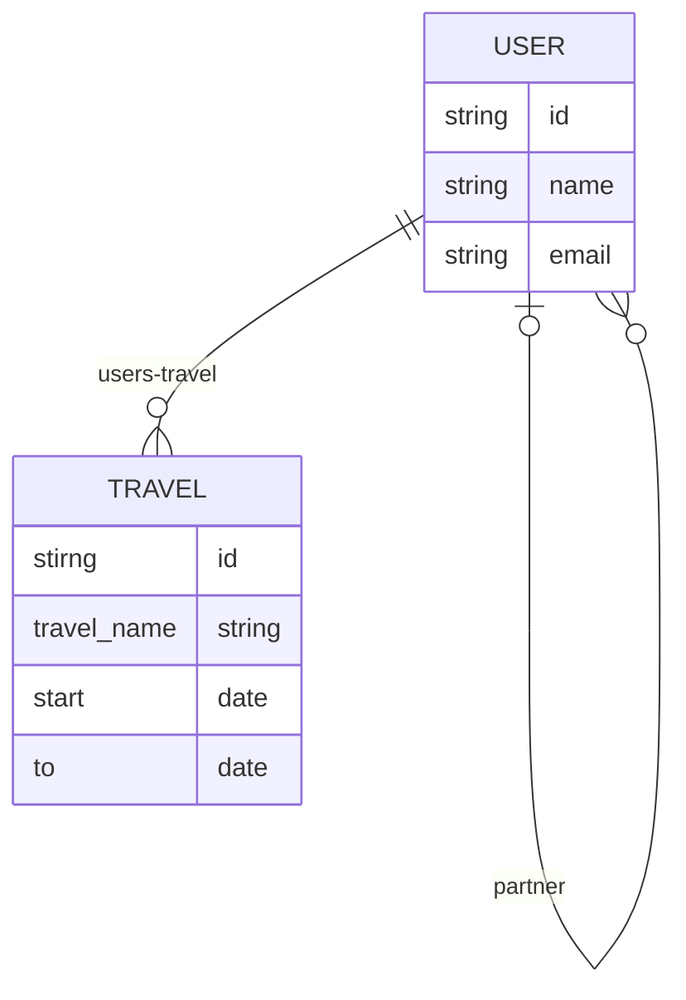

# Schema of DB

```mermaid
erDiagram

    USER {
        string id
        string name
        string email
    }
    
    TRAVEL {
        stirng id
        travel_name string
        start date
        to date
    }

    USER |o--o{ USER : partner
    USER ||--o{ TRAVEL: users-travel

```