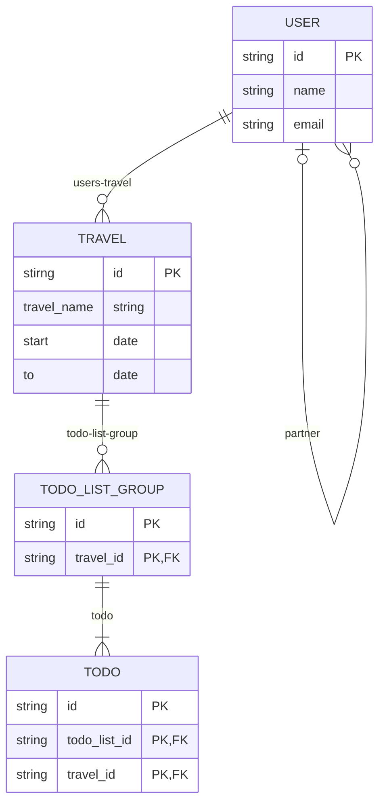

# Schema of DB

```mermaid
erDiagram

    USER {
        string id PK
        string name
        string email
    }
    
    TRAVEL {
        stirng id PK
        travel_name string
        start date
        to date
    }
    
    TODO_LIST_GROUP {
        string id PK
        string travel_id PK,FK
    }
    
    TODO {
        string id PK
        string todo_list_id PK,FK
        string travel_id PK,FK
    }

    USER |o--o{ USER : partner
    USER ||--o{ TRAVEL: users-travel
    TRAVEL ||--o{ TODO_LIST_GROUP: todo-list-group
    TODO_LIST_GROUP ||--|{ TODO: todo
```