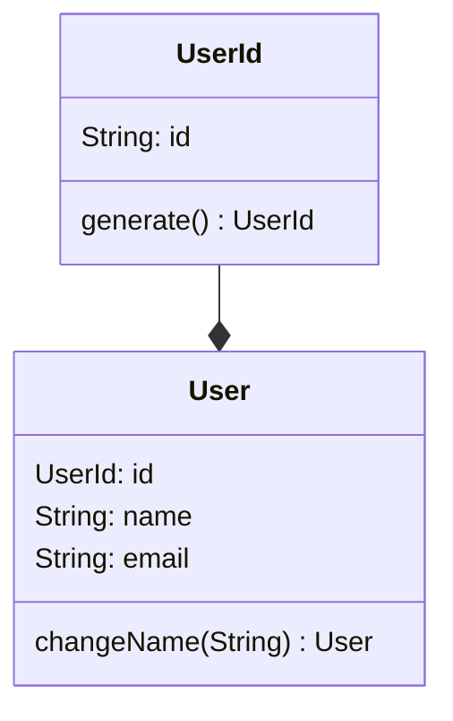
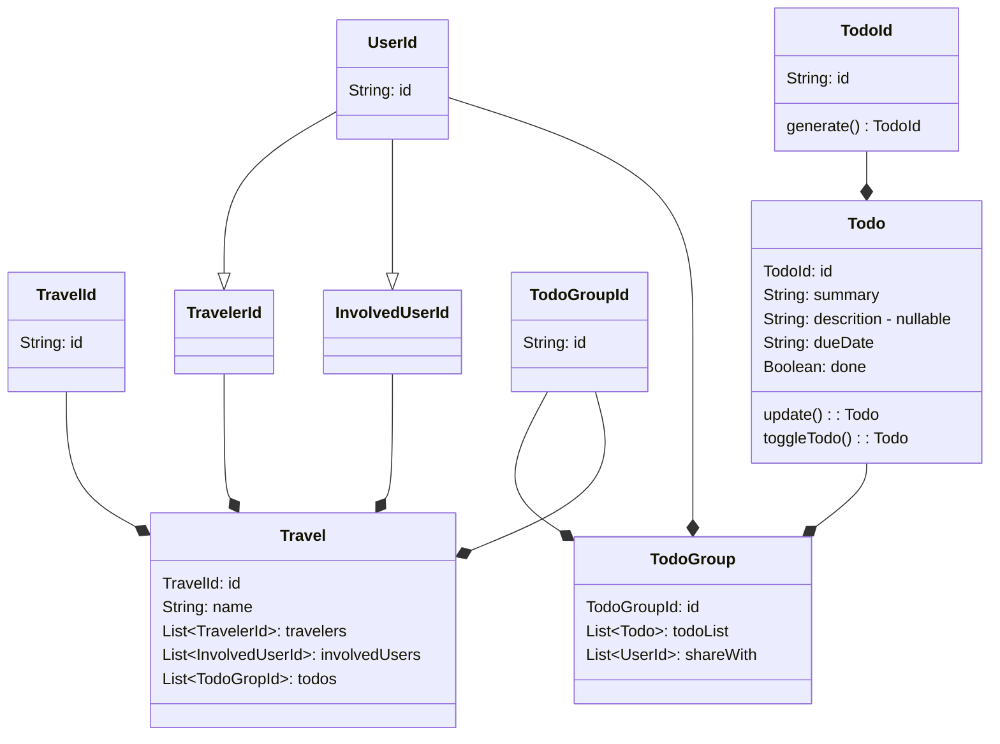

# Models

## User

```mermaid
classDiagram
    class UserId {
        String: id 
        generate() UserId
    }
    
    class User { 
        UserId: id
        String: name
        String: email
        changeName(String) User
    }
    
    UserId --* User
```

## Travel

```mermaid
classDiagram
    class TravelId {
        String: id
    }
    
    class Travel {
        TravelId: id
        String: name    
        List~TravelerId~: travelers
        List~InvolvedUserId~: involvedUsers
        List~TodoGropId~: todos
    }
    
    class UserId {
        String: id
    }
    
    class TravelerId {
    }
    
    class InvolvedUserId {
    }    
    
    class TodoGroupId {
        String: id
    }
    
    class TodoGroup {
        TodoGroupId: id
        List~Todo~: todoList
        List~UserId~: shareWith
    }
    
    class TodoId {
        String: id
        generate() TodoId
    }
    
    class Todo {
        TodoId: id
        String: summary
        String: descrition - nullable
        String: dueDate
        Boolean: done
        update(): Todo
        toggleTodo(): Todo
    }

    UserId --|> TravelerId
    UserId --|> InvolvedUserId
    TravelId --* Travel
    TravelerId --* Travel
    InvolvedUserId --* Travel
    Todo --* TodoGroup
    TodoGroupId --* TodoGroup
    UserId --* TodoGroup
    TodoGroupId --* Travel
    TodoId --* Todo
```