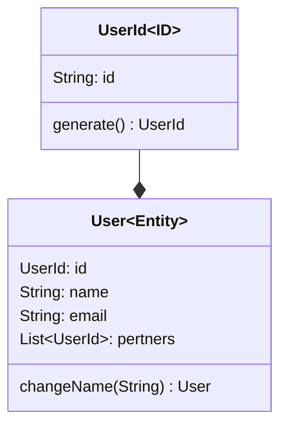
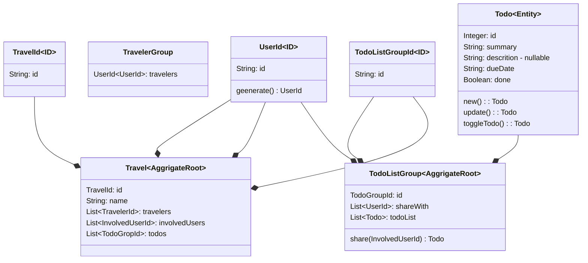

# Models

## User

```mermaid
classDiagram
    class UserId~ID~ {
        String: id 
        generate() UserId
    }
    
    class User~Entity~ { 
        UserId: id
        String: name
        String: email
        List~UserId~: pertners
        changeName(String) User
    }
    
    UserId --* User
```

## Travel

```mermaid
classDiagram
    class TravelId~ID~ {
        String: id
    }
    
    class Travel~AggrigateRoot~ {
        TravelId: id
        String: name    
        List~TravelerId~: travelers
        List~InvolvedUserId~: involvedUsers
        List~TodoGropId~: todos
    }
    
    class TravelerGroup {
        UserId~UserId~: travelers
    }
    
    class UserId~ID~ {
        String: id
        geenerate() UserId
    }
    
    class TodoListGroupId~ID~ {
        String: id
    }
    
    class TodoListGroup~AggrigateRoot~ {
        TodoGroupId: id
        List~UserId~: shareWith
        List~Todo~: todoList
        share(InvolvedUserId) Todo
    }
    
    class Todo~Entity~ {
        Integer: id
        String: summary
        String: descrition - nullable
        String: dueDate
        Boolean: done
        new(): Todo
        update(): Todo
        toggleTodo(): Todo
    }

    TravelId --* Travel
    UserId --* Travel
    
    UserId --* Travel
    Todo --* TodoListGroup
    TodoListGroupId --* TodoListGroup
    UserId --* TodoListGroup
    TodoListGroupId --* Travel
```